# 🛡️ SecureShare

[](https://github.com/your-username/secureshare)

> **A production-grade, full-stack file storage system featuring stream-based uploads, granular Role-Based Access Control (RBAC), and secure public sharing.**

**SecureShare** is designed to replicate the core functionality of enterprise tools like Google Drive. It solves critical engineering challenges such as handling large file uploads without server crashes (using Streams), managing complex ownership permissions, and providing a seamless "Shadcn-style" dark mode experience.

---

## 🚀 Executive Summary

- **Goal**: Build a scalable, secure file repository that doesn't rely on third-party cloud storage (S3) for core logic.
- **Target Audience**: Enterprises, Privacy-focused teams, and Developers needing a reference architecture.
- **Key Value**: Total control over data, zero-knowledge architectural principles, and high-performance file handling.

---

## ✨ Core Features

### 📂 Intelligent Dashboard

- **Dynamic File Recognition**:
  - **Auto-Icons**: Automatically detects MIME types to render specific icons for PDFs 📕, Images 🖼️, Code 💻, and Archives 📦.
  - **Live Search**: Instant client-side filtering by filename without API latency.
  - **Smart Stats**: Visual cards showing total storage used and file counts.

### ⚡ Stream-Based Upload Engine

- **RAM Optimization**: Unlike standard uploaders that load files into RAM, SecureShare uses **Node.js Streams**.
  - _Edge Case Handled_: A 512MB server can process a 10GB file upload because only 64KB chunks are processed at a time.
- **Bulk Processing**: Drag-and-drop support for multiple files simultaneously.

### 🔒 Granular Access Control (ACL)

- **Ownership Logic**:
  - **Owner**: Full control (Delete, Share, Revoke).
  - **Editor/Viewer**: Can view and download, but cannot destroy the original file.
- **Smart Revocation**:
  - **Kick User**: Owners can remove specific users from a file.
  - **Leave File**: Users can remove _themselves_ from shared files without deleting the file for everyone else.

### 🔗 Secure Sharing

- **Public Magic Links**: Generate cryptographically secure, random tokens for public access.
  - **Auto-Expiry**: Links automatically become invalid after 24 hours.
- **Direct Email Invites**: Add registered users directly to the file's Access Control List.

---

## 🧠 System Logic & Edge Cases

We implemented specific logic to handle complex real-world scenarios:

### 1. The "Delete" Paradox

- **Scenario**: User A shares a file with User B. User B clicks "Delete".
- **Logic**: The system checks the user's role.
  - If **Owner**: The file is permanently deleted from the Database AND the Disk (`fs.unlink`).
  - If **Viewer**: The user is only removed from the `accessControl` array. The file remains safe for the owner.

### 2. The "Ghost File" Prevention

- **Scenario**: A record is deleted from MongoDB, but the binary file remains in the `uploads/` folder, eating up disk space over years.
- **Logic**: We implemented a strict synchronous cleanup. When `File.deleteOne()` is called, the controller locates the physical path and executes a filesystem removal immediately.

### 3. Secure Previews (Blob Isolation)

- **Scenario**: Viewing a PDF or Image should not require downloading it to the user's "Downloads" folder.
- **Logic**: We fetch the binary stream using an Auth Token, convert it to a **Blob Object**, and generate a temporary `blob:` URL. This allows secure in-browser viewing that is revoked immediately upon closing the modal to prevent memory leaks.

---

## 🎨 UI/UX Design System

- **Theme**: "Cyber-Security" Dark Mode.
- **Palette**:
  - **Background**: Slate 950 (Deep, professional dark).
  - **Accents**: Blue 600 (Primary actions), Red 500 (Destructive actions).
  - **Surface**: Glassmorphism effects with backdrop blur.
- **Animations**:
  - **Framer Motion**: Smooth entry/exit animations for table rows and modals.
  - **Micro-interactions**: Hover states on action menus and buttons.

---

## 🧱 System Architecture

```mermaid
flowchart TD

%% ─────────────── CLIENT SIDE ───────────────
subgraph Client["Frontend (React + Vite)"]
    Auth["Auth Context"]
    Dash["Dashboard UI"]
    Stream["File Streamer"]
end

%% ─────────────── SERVER SIDE ───────────────
subgraph Server["Backend (Node + Express)"]
    Middleware["Auth Middleware - JWT"]
    Controller["File Controller"]
    StreamPipe["Multer Stream Pipe"]
end

%% ─────────────── DATA ───────────────
subgraph Data["Persistence"]
    Mongo["MongoDB - Metadata"]
    Disk["Local Disk /uploads"]
end

%% FLOWS
Client -->|Bearer Token| Middleware
Middleware -->|Validated User| Controller

%% Upload Flow
Stream -->|Multipart Chunk| StreamPipe
StreamPipe -->|Write Stream| Disk
StreamPipe -->|File Metadata| Mongo

%% Access Flow
Dash -->|Request File| Controller
Controller -->|Check Access Control| Mongo
Mongo -->|Permission OK| Controller
Controller -->|Read Stream| Disk
Disk -->|Binary Data| Dash

```



---

## 🛠️ Tech Stack

| Component         | Technology                                                                                                                                                                                                | Description                         |
| ----------------- | --------------------------------------------------------------------------------------------------------------------------------------------------------------------------------------------------------- | ----------------------------------- |
| **Frontend**      |                                                                                                                 | Vite-powered SPA                    |
| **Styling**       |  <br>  | Utility-first + Shadcn UI           |
| **Backend**       |  <br>    | Event-driven Runtime                |
| **Database**      |                                                                                                            | NoSQL Document Store                |
| **Security**      |                                                                                                              | Stateless Authentication            |
| **File Handling** |  <br>    | Multipart / Stream-based processing |

---

## ⚙️ Setup & Installation

### Prerequisites

- Node.js (v18+)
- MongoDB (Local or Atlas)

### 🚀 Quick Start

#### Clone the repository

```bash
git clone https://github.com/your-username/secureshare.git
cd secureshare
```

#### Backend Setup

```bash
cd Backend
npm install
# Create .env with: PORT=5000, MONGO_URI=..., JWT_SECRET=...
npm run dev
```

#### Frontend Setup

```bash
cd Frontend
npm install
npm run dev
```

#### Access App

Open http://localhost:5173

---

## 📂 Project Structure

```bash
├── Backend/
│   ├── config/         # DB connection logic
│   ├── controllers/    # Business logic (Auth, Files)
│   ├── middleware/     # Auth checks, Error handling
│   ├── models/         # Mongoose schemas
│   ├── routes/         # API endpoints
│   └── uploads/        # Local storage (GitIgnored)
│
└── Frontend/
    ├── src/
    │   ├── components/ # Reusable UI components (Modals, Cards)
    │   ├── context/    # Auth state management
    │   ├── features/   # API service calls
    │   └── pages/      # Route views (Dashboard, Login)
```

---

## 🔒 Security Highlights

- **No RAM Overload**: Files are streamed directly to disk, preventing memory crashes on large uploads.
- **Access Isolation**: Backend middleware verifies `req.user._id` against the file's `accessControl` array before serving any byte.
- **Sanitization**: Filenames are sanitized, and "Magic Byte" detection (planned) prevents spoofing extensions.

---

## 🤝 Git Workflow

| Branch      | Purpose                                          |
| :---------- | :----------------------------------------------- |
| `main`      | 🛡️ Production ready code.                        |
| `develop`   | 🚧 Integration branch for testing.               |
| `feature/*` | ✨ Feature branches (e.g., `feature/ui-polish`). |

---

<p align="center">Built with ❤️ by Sanket Pilane</p>
