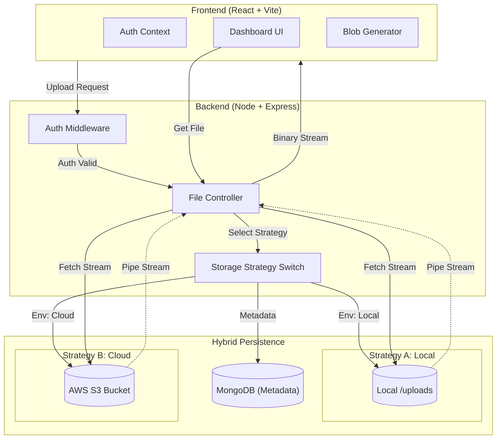

# 🛡️ SecureShare

[](https://github.com/your-username/secureshare)

> **A production-grade, full-stack file storage system featuring stream-based uploads, granular Role-Based Access Control (RBAC), secure public sharing, and Hybrid Cloud Storage.**

**SecureShare** is designed to replicate the core functionality of enterprise tools like Google Drive. It solves critical engineering challenges such as handling large file uploads without server crashes (using Streams), managing complex ownership permissions, and providing a seamless "Shadcn-style" dark mode experience.

---

## 🚀 Executive Summary

- **Goal**: Build a scalable, secure file repository that serves as a reference architecture for Hybrid Cloud systems.
- **Target Audience**: Enterprises, Privacy-focused teams, and Developers.
- **Key Value**: Total control over data with the flexibility to switch between On-Premise (Local) and Cloud (AWS S3) storage instantly.

---

## ✨ Core Features

### 📂 Intelligent Dashboard

- **Dynamic File Recognition**:
  - **Auto-Icons**: Automatically detects MIME types to render specific icons for PDFs 📕, Images 🖼️, Code 💻, and Archives 📦.
  - **Live Search**: Instant client-side filtering by filename without API latency.
  - **Smart Stats**: Visual cards showing total storage used and file counts.

### ⚡ Stream-Based Upload Engine

- **RAM Optimization**: Unlike standard uploaders that load files into RAM, SecureShare uses **Node.js Streams**.
  - _Edge Case Handled_: A 512MB server can process a 10GB file upload because only 64KB chunks are processed at a time.
- **Bulk Processing**: Drag-and-drop support for multiple files simultaneously.

### 🔒 Granular Access Control (ACL)

- **Ownership Logic**:
  - **Owner**: Full control (Delete, Share, Revoke).
  - **Editor/Viewer**: Can view and download, but cannot destroy the original file.
- **Smart Revocation**:
  - **Kick User**: Owners can remove specific users from a file.
  - **Leave File**: Users can remove _themselves_ from shared files without deleting the file for everyone else.

### 🔗 Secure Sharing

- **Public Magic Links**: Generate cryptographically secure, random tokens for public access.
  - **Auto-Expiry**: Links automatically become invalid after 24 hours.
- **Direct Email Invites**: Add registered users directly to the file's Access Control List.

---

## ☁️ Hybrid Storage Architecture (New)

We implemented a **Strategy Pattern** for file storage, allowing the application to switch between Local Disk Storage and AWS S3 Storage via a simple environment variable.

### 1. Local Storage Strategy (`USE_CLOUD_STORAGE=false`)

- **How it works**: Files are streamed directly to the server's local `uploads/` directory.
- **Use Case**: Development, Offline environments, or Air-gapped internal servers.
- **Delivery**: The backend serves files using `res.download()` from the physical disk.

### 2. AWS S3 Strategy (`USE_CLOUD_STORAGE=true`)

- **How it works**: Multer streams the upload directly to an AWS S3 Bucket. The server never stores the file on disk.
- **Use Case**: Production, Scalable deployments (Render/Vercel/Heroku).
- **Delivery (Proxy Stream)**:
  - To solve CORS and Security issues, we do _not_ expose the raw S3 URL.
  - Instead, the Backend fetches the file from S3 and **pipes** it to the Frontend (`S3 -> Backend -> Client`).
  - This ensures files remain private and can only be accessed by authenticated users via our API.

---

## 🧠 System Logic & Edge Cases

We implemented specific logic to handle complex real-world scenarios:

### 1. The "Delete" Paradox

- **Scenario**: User A shares a file with User B. User B clicks "Delete".
- **Logic**: The system checks the user's role.
  - If **Owner**: The file is permanently deleted from the Database AND the Disk/S3 bucket.
  - If **Viewer**: The user is only removed from the `accessControl` array. The file remains safe for the owner.

### 2. The "Ghost File" Prevention

- **Scenario**: A record is deleted from MongoDB, but the binary file remains in the `uploads/` folder or S3 Bucket, costing money.
- **Logic**: We implemented a strict synchronous cleanup. When `File.deleteOne()` is called, the controller locates the physical path (or S3 Key) and executes a removal command immediately before removing the DB record.

### 3. Secure Previews (Blob Isolation)

- **Scenario**: Viewing a PDF or Image should not require downloading it to the user's "Downloads" folder.
- **Logic**: We fetch the binary stream using an Auth Token, convert it to a **Blob Object**, and generate a temporary `blob:` URL. This allows secure in-browser viewing that is revoked immediately upon closing the modal.

---

## 🎨 UI/UX Design System

- **Theme**: "Cyber-Security" Dark Mode.
- **Palette**:
  - **Background**: Slate 950 (Deep, professional dark).
  - **Accents**: Blue 600 (Primary actions), Red 500 (Destructive actions).
  - **Surface**: Glassmorphism effects with backdrop blur.
- **Animations**:
  - **Framer Motion**: Smooth entry/exit animations for table rows and modals.
  - **Micro-interactions**: Hover states on action menus and buttons.

---

## 🧱 System Architecture



---

## 🛠️ Tech Stack

| Component         | Technology                                                                                                                                                                                                | Description                         |
| ----------------- | --------------------------------------------------------------------------------------------------------------------------------------------------------------------------------------------------------- | ----------------------------------- |
| **Frontend**      |                                                                                                                 | Vite-powered SPA                    |
| **Styling**       |  <br>  | Utility-first + Shadcn UI           |
| **Backend**       |  <br>    | Event-driven Runtime                |
| **Database**      |                                                                                                            | NoSQL Document Store                |
| **Security**      |                                                                                                              | Stateless Authentication            |
| **File Handling** |  <br>    | Multipart / Stream-based processing |

---

## ⚙️ Setup & Installation

### Prerequisites

- Node.js (v18+)
- MongoDB (Local or Atlas)
- AWS Account (Optional, for Cloud Mode)

### 🚀 Quick Start

#### 1. Clone the repository

```bash
git clone https://github.com/your-username/secureshare.git
cd secureshare
```

#### 2. Backend Setup

```bash
cd Backend
npm install
```

Create a `.env` file:

```
PORT=5000
MONGO_URI=mongodb://localhost:27017/secureshare
JWT_SECRET=your_super_secret_key

# STORAGE STRATEGY (true = S3, false = Local)
USE_CLOUD_STORAGE=false

# AWS CONFIG (Only required if USE_CLOUD_STORAGE=true)
AWS_ACCESS_KEY_ID=your_key
AWS_SECRET_ACCESS_KEY=your_secret
AWS_REGION=us-east-1
AWS_BUCKET_NAME=your-bucket
```

Run the server:

```bash
npm run dev
```

#### 3. Frontend Setup

```bash
cd Frontend
npm install
npm run dev
```

#### 4. Access App

Open http://localhost:5173

---

## 📂 Project Structure

```bash
├── Backend/
│   ├── config/         # DB connection logic
│   ├── controllers/    # Business logic (Auth, Files)
│   ├── middleware/     # Auth checks, Error handling
│   ├── models/         # Mongoose schemas
│   ├── routes/         # API endpoints
│   └── uploads/        # Local storage (GitIgnored)
│
└── Frontend/
    ├── src/
    │   ├── components/ # Reusable UI components (Modals, Cards)
    │   ├── context/    # Auth state management
    │   ├── features/   # API service calls
    │   └── pages/      # Route views (Dashboard, Login)
```

---

## 🔒 Security Highlights

- **No RAM Overload**: Files are streamed directly to disk, preventing memory crashes on large uploads.
- **Access Isolation**: Backend middleware verifies `req.user._id` against the file's `accessControl` array before serving any byte.
- **S3 Key Encoding**: Handles special characters and spaces in filenames to prevent NoSuchKey errors during AWS retrieval.

---

## 🤝 Git Workflow

| Branch      | Purpose                                          |
| :---------- | :----------------------------------------------- |
| `main`      | 🛡️ Production ready code.                        |
| `develop`   | 🚧 Integration branch for testing.               |
| `feature/*` | ✨ Feature branches (e.g., `feature/ui-polish`). |

---

<p align="center">Built with ❤️ by Sanket Pilane</p>
